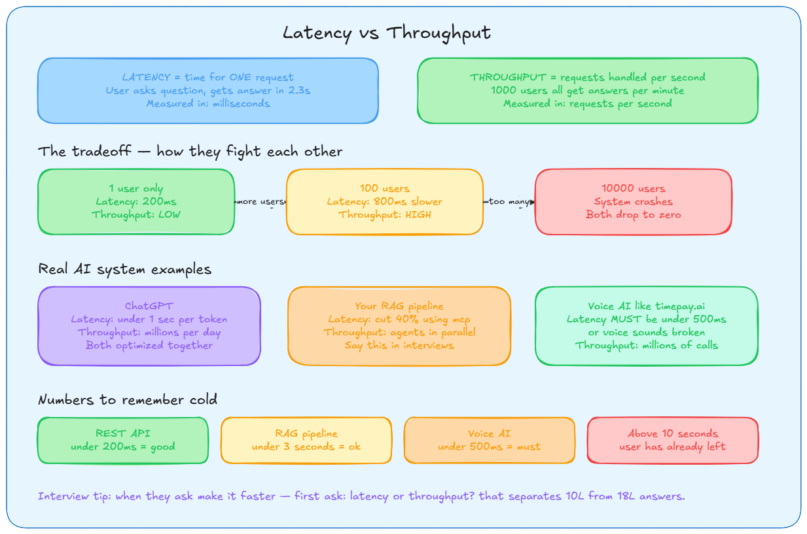
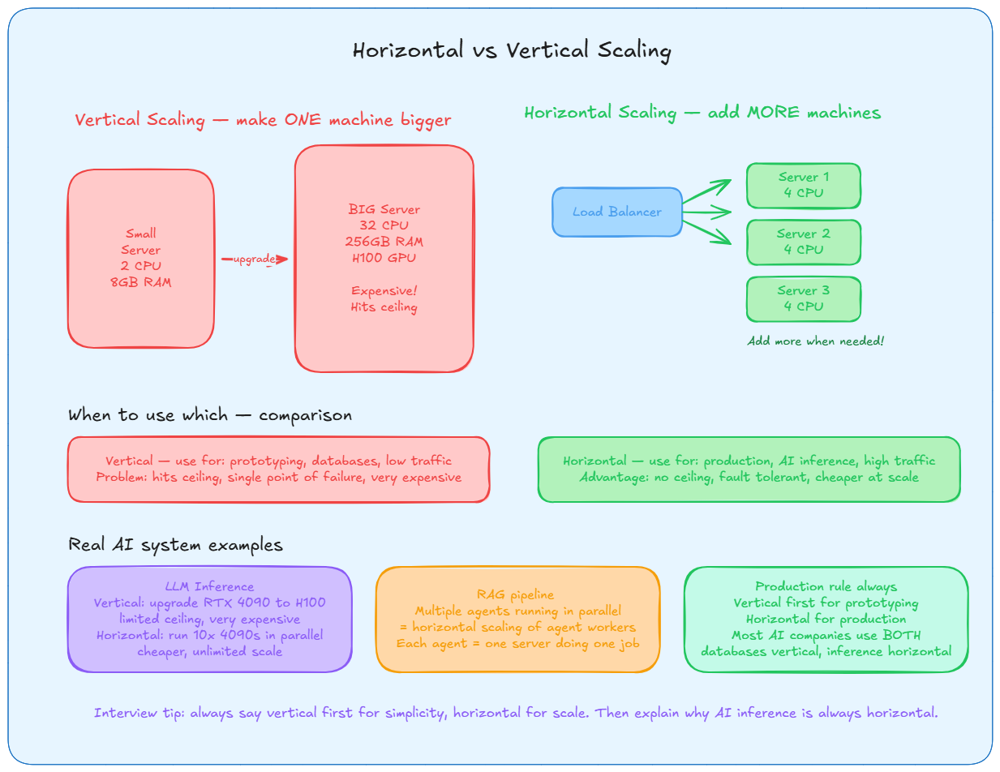
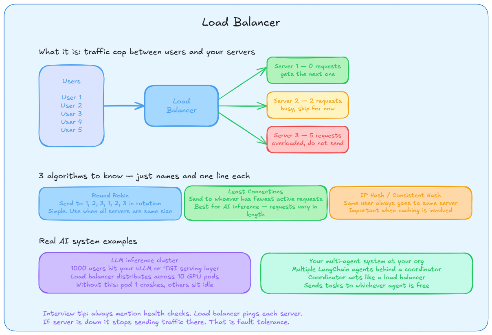
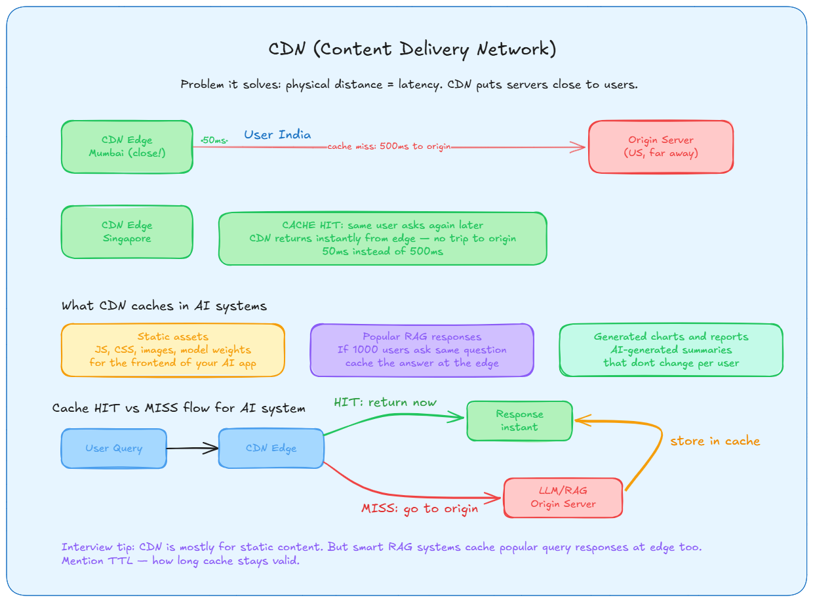
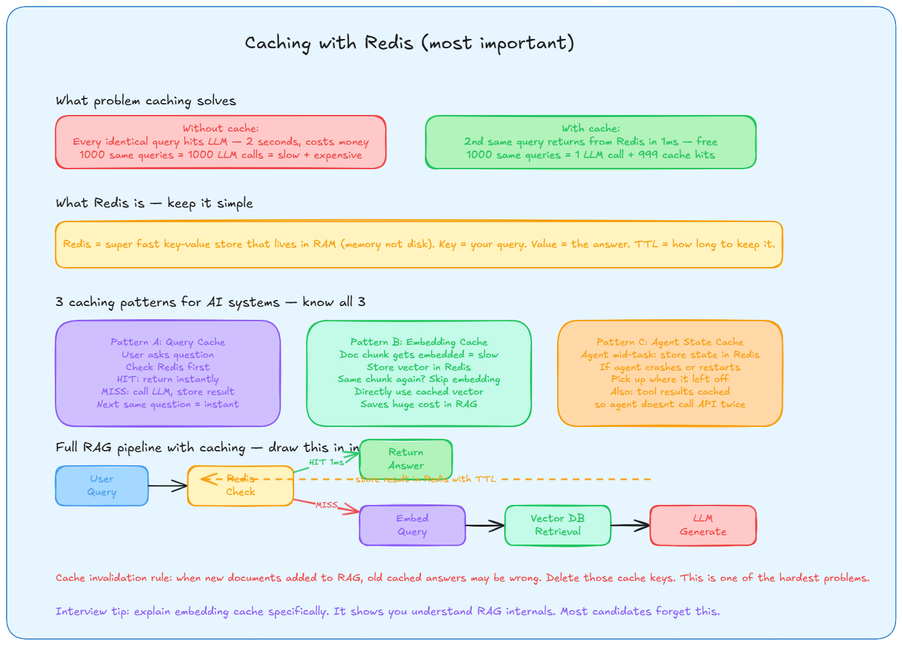
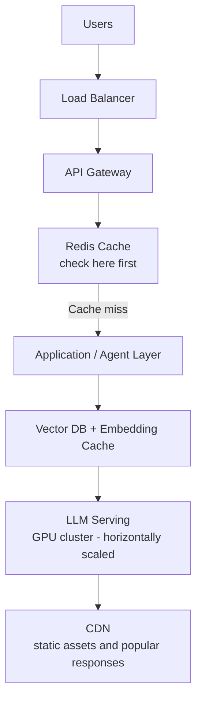

### **CONCEPT 1 Latency vs Throughput**

Latency is how long ONE request takes. You send a query, timer starts, answer comes back, timer stops. That number in milliseconds is your latency.

Throughput is how many requests your system handles per second across ALL users. Not one person. Everyone.

They fight each other because resources are shared. When 100 people hit your system at once, each person gets a smaller slice of CPU and memory. So each individual response takes longer. Latency goes up. Push too far and the system collapses. Both drop to zero.

**Formula worth knowing:** Throughput = concurrent requests / average latency. So if your RAG takes 1 second per query and you can handle 100 concurrent requests, your throughput is 100 requests per second.

**How to optimize each:**
- Reduce latency -> smaller models, caching, better hardware, async calls
- Increase throughput -> more servers, horizontal scaling, GPU sharding, queues

**Your interview answer when asked this:** at your organization you reduced query latency by 40% using MCP. That means the same request completes faster. That is a concrete latency optimization. Always mention this.

### **CONCEPT 2 Horizontal vs Vertical Scaling**

Vertical scaling means you take your one machine and make it more powerful. Bigger CPU, more RAM, better GPU. Simple. But it has a ceiling. There is no machine in the world with infinite resources. Also if that one machine dies, your whole system dies.

Horizontal scaling means you buy more normal machines and put a load balancer in front. Now if one machine dies, others keep going. And when traffic grows, just spin up more machines. This is how every big AI company runs inference.

**For databases specifically**, most companies still use vertical scaling because databases are hard to split across machines. For application servers and AI inference, always horizontal.

**Your real example:** At your organization you ran multiple agents in parallel using LangChain and LangGraph. Each agent running independently IS horizontal scaling of the agent layer. That's a real example.

### **CONCEPT 3 Load Balancer**

A load balancer sits in front of all your servers. Every incoming request hits the load balancer first. The load balancer decides which server to send it to based on an algorithm.

Why this matters: without it, one server gets crushed while others sit idle. With it, traffic is distributed evenly.

**Health checks** are critical. The load balancer constantly pings each server asking "are you alive?" If a server goes down, load balancer stops sending traffic there automatically. This is what gives you 99.9% uptime.

**For AI inference specifically**, use Least Connections because LLM requests vary wildly in length. A simple question takes 200ms. A complex reasoning task takes 5 seconds. Round Robin would be unfair here.

### **CONCEPT 4 CDN**

### **CONCEPT 5 Caching with Redis (most important one)**

Redis is an in-memory key-value store. Everything lives in RAM, not disk. That is why reads are under 1ms. You store a query as the key and the LLM response as the value. Next time same query comes in, you skip the LLM entirely.

**TTL** (time to live) - every cached item has an expiry. After that time it gets deleted automatically. For news summaries maybe 1 hour. For static facts maybe 24 hours. You decide based on how often the data changes.

**The 3 patterns you MUST know:**

Pattern A - Query cache. Most basic. Cache the final answer. Same question comes in, return cached answer instantly.

Pattern B - Embedding cache. This is the smart one. Every time you embed a document chunk it costs money and time. If the same chunk gets embedded again, that is wasted compute. Cache the vector. Next time, skip the embedding model entirely.

Pattern C - Agent state cache. Your LangGraph agents at your organization work in steps. If an agent crashes halfway through a task, you lose all progress. If you store agent state in Redis after each step, it can resume from where it stopped. Also cache tool results so the agent doesn't call the same external API twice.

**Cache invalidation** - when you add new documents to your RAG system, some old cached answers might now be wrong because better context exists. You have to delete or update those cache entries. This is genuinely hard to get right.

### **Day 1 Complete Summary - The Full System**

Take this diagram as your mental model for everything:

**Every arrow in that diagram has a latency cost. Your job as an AI engineer is to minimize that cost at every step.**

### **Interview Questions with Answers**

### **Section 1 - Latency vs Throughput (Q1 to Q5)**

**Q1. What is the difference between latency and throughput? Give an AI example.**

Latency is the time taken for one single request to complete. Throughput is how many requests the system handles per second across all users. They are different things.

AI example: ChatGPT feels fast because latency is low, under 1 second per response. But it also handles millions of users simultaneously, that is high throughput. Both are optimized together using caching, horizontal scaling, and GPU batching.

Interview tip: always clarify in your answer whether you are optimising for latency or throughput - that question alone separates 10L from 18L answers.

**Q2. In a RAG system, why can you have low latency but poor throughput?**

Your embedding model and vector DB are fast for one query so latency is fine. But if you only have one GPU pod, it cannot handle 1000 concurrent users. So throughput is terrible even though individual speed is good.

Fix: horizontal scaling, add more inference pods behind a load balancer, and add an embedding cache in Redis so you are not hitting the GPU for every request.

**Q3. How would you explain latency vs throughput to a product manager who wants both instant answers and millions of users?**

You say: latency is how fast one user gets their answer. Throughput is how many users we can serve at the same time. We cannot maximize both without tradeoffs. The way we get both is through caching so common queries skip the LLM entirely, and horizontal scaling so we have enough servers to handle volume. Neither alone is enough.

**Q4. What is more important in a voice AI agent - latency or throughput? Why?**

Latency comes first. micro-batching with backpressure lets you balance GPU efficiency against time-to-first-token, but for voice specifically if the response takes more than 500ms the conversation feels broken. Users will not tolerate delay in voice even if your system handles millions of calls.

Throughput becomes important at scale but you solve latency first. You add async pipelines and response caching to keep latency low while scaling throughput over time.

**Q5. Your RAG system has 2 second latency at peak. How do you debug it?**

Break it down end to end. Query comes in, goes through embedding, then vector search, then reranking, then LLM generation. Check each step.

Most latency in RAG hides in two places: the embedding call if you are not caching it, and the LLM generation if the model is too large or the GPU is queued. Check Redis hit rate first. If it is below 80%, your cache is not working. Then check GPU queue length. Then check if reranking is pulling too many candidates.

Target: embedding under 100ms, retrieval under 200ms, LLM under 1.5 seconds total end to end under 2 seconds.

### **Section 2 - Scaling (Q6 to Q10)**

**Q6. Explain vertical vs horizontal scaling. Which do you prefer for AI systems and why?**

Vertical means making one machine more powerful. More CPU, RAM, better GPU. Simple but hits a ceiling and if that machine dies everything dies.

Horizontal means adding more machines behind a load balancer. No ceiling, fault tolerant, cheaper at scale.

you should describe horizontal scaling for stateless inference services and vertical scaling or distributed training strategies for compute-heavy tasks. In practice: prototype on vertical, go horizontal for production. Databases stay vertical, inference goes horizontal.

**Q7. Your RAG system hits 10k requests per second and latency is spiking. How do you scale it?**

First, do not panic and throw money at hardware.

Step one: check Redis hit rate. If it is low, fix caching first. That is free throughput.
Step two: add more inference pods horizontally behind the load balancer.
Step three: shard the vector DB if retrieval is the bottleneck.
Step four: set up autoscaling so pods spin up automatically when queue depth rises.

mention batching requests to optimize GPU utilization and implementing caching for repeated queries. Never vertical scale first in production AI.

**Q8. What happens if you only do vertical scaling for an agentic AI system?**

You hit GPU limits fast. Cost explodes because high end hardware is exponentially expensive. And you have a single point of failure - one machine goes down and your entire agent system is dead.

Also with agents specifically, if one machine is handling all agent state and tool calls and it crashes mid-task, you lose everything. Horizontal scaling with Redis state persistence solves this.

**Q9. We expect 10x traffic next month. Walk me through your scaling plan for a document QA RAG system.**

Start by measuring current numbers. What is your baseline latency and throughput today.

Then: add load balancer in front of inference layer. Introduce Redis cache for both embeddings and query responses. Shard vector DB if you have over 10 million chunks. Horizontal GPU pods with autoscaling. Set up observability with latency, throughput, and cache hit rate dashboards. Do a load test before traffic hits.

**Q10. Conversational follow-up: you said horizontal scaling. But what if the new machines make things slower because of coordination overhead?**

Good question. This happens when your system is stateful and machines need to talk to each other constantly. The fix is to make your inference layer stateless. Each pod handles one request independently with no shared in-memory state. All shared state goes to Redis. That way adding more pods never increases coordination cost.

every design involves trade-offs. evaluate the pros and cons of your choices, such as consistency versus availability, or latency versus throughput. Stateless horizontal scaling is the cleanest design for AI inference.

### **Section 3 - Load Balancer (Q11 to Q15)**

**Q11. What is a load balancer and why do we need it?**

It sits in front of your servers and distributes incoming requests so no single server gets overloaded. load balancers minimize server response time and maximize throughput and ensure high availability and reliability by sending requests only to online servers.

Without it: one server crashes under load while others sit idle. With it: traffic spreads evenly, failed servers are removed automatically via health checks.

**Q12. Your LLM inference cluster has 10 GPU pods. How does the load balancer help?**

It spreads requests across all 10 pods. For LLM inference specifically, use Least Connections algorithm because requests vary wildly in length. A simple query takes 200ms, a complex reasoning task takes 5 seconds. Round Robin would send too many long requests to the same pod.

Health checks run continuously. If a GPU pod crashes, the load balancer stops sending traffic there within seconds. Users do not see any downtime.

**Q13. How do you choose a load balancing algorithm for a RAG system?**

Least Connections for the inference layer because request durations are uneven.

Consistent Hashing if you have aggressive caching and want the same query to always hit the same pod, which improves cache hit rate on that pod.

Round Robin only for simple cases where all requests are roughly the same size and duration, like a lightweight embedding API.

**Q14. Design a scalable architecture for a high-traffic AI chat app. How do you use load balancers?**

Users hit a Layer 7 load balancer first. It routes to API gateway based on path. API gateway checks Redis cache. On cache miss it routes to inference pods, which are horizontal and autoscaled. Load balancer does health checks every 5 seconds. Failed pods removed instantly.

at a high level propose a multi-tier architecture. clients connect via a load balancer which sits in front of a pool of servers that handle application logic and talk to backend services like databases and caches.

**Q15. Conversational: interviewer asks why not just use DNS load balancing instead of a real load balancer?**

DNS load balancing is simpler but has two big problems. First it has no health checking - if a server dies DNS keeps sending traffic there until TTL expires. That can be minutes of downtime. Second, DNS changes propagate slowly so you cannot react to traffic spikes in real time.

A proper load balancer has sub-second health checks, instant failover, and can do content-based routing like sending /embed requests to embedding pods and /generate requests to LLM pods. That kind of control you cannot get from DNS.

### **Section 4 - Caching + Redis (Q16 to Q20)**

**Q16. What are the two most important caches in a RAG or agent system?**

Embedding cache and response cache.

Embedding cache: same document chunk always produces the same vector. Cache it in Redis. Skip the embedding model entirely on repeat. This is the biggest cost saver in production RAG.

Response cache: if 1000 users ask the same question, run the LLM once, cache the answer, serve the rest from Redis in under 1ms. use caching like Redis to store frequently accessed search results and reduce latency.

**Q17. Your vector DB reads are slow and costs are spiking from repeated embeddings. How do you fix it?**

Two separate problems, two separate fixes.

For slow reads: add Redis in front of vector DB. Cache the top-K retrieval results for popular queries. HNSW index in the vector DB if you do not have it already.

For embedding costs: Redis embedding cache with TTL of 24 hours for stable documents. Hash the document ID as the key. On cache miss, embed and store. On cache hit, skip embedding model entirely. use LRU cache for memory optimization when Redis memory fills up.

**Q18. How do you handle cache invalidation when new documents are added to your RAG system?**

This is the hardest part of caching. When new documents come in, old cached answers might now be wrong because better context exists.

Options: delete cached answers by document ID prefix when a doc is updated. Or use short TTL on answers, maybe 1 hour, so stale answers expire naturally. For embedding cache, only invalidate when the document content actually changes, not just metadata.

Also keep separate TTLs for hot documents that change often versus cold documents that rarely change.

**Q19. Your agent crashed mid-task after calling 3 tools. How do you prevent losing all that work?**

Store agent state in Redis after every tool call. Key is user ID plus session ID plus step number. Value is the full agent state including what tools were called, what results came back, and what step is next.

On restart, agent reads from Redis, sees it was on step 3, continues from there. Tool results are also cached so it does not call the same external API again.

This is Pattern C from the caching patterns. Your LangGraph work at VE3 already does stateful workflows - this is the production version of that.

**Q20. Full scenario: we want sub-100ms responses for our voice AI agent. Walk me through your architecture using everything from Day 1.**

start by clarifying requirements. how many users, what are the latency and throughput requirements.

Then draw the data flow:

User voice input -> transcription layer (ASR, latency under 100ms) -> Redis check for cached response -> on hit return instantly -> on miss go to RAG pipeline -> embedding (cached) -> vector retrieval (HNSW indexed) -> LLM generation (smallest model that meets quality bar) -> cache result -> return to user -> TTS layer.

Components: load balancer in front of all inference pods using Least Connections. Redis for embedding cache, response cache, and agent state. Horizontal GPU pods for LLM. CDN for static assets. Autoscaling based on queue depth.

Key insight: cost-awareness is particularly important in LLM-based systems where token usage directly impacts expenses. Use smallest model that meets the quality bar. Cache aggressively. Monitor latency at every step, not just end to end.

### **Quick Practice Rules**

Read question -> cover answer -> say it out loud -> check. 1-2 minutes max per answer.

Red flags: if you cannot draw the flow on paper for Q14, Q17, or Q20 you need to go back. If your answer takes more than 90 seconds you are being too wordy. If you forget to mention tradeoffs you are giving a junior answer.

