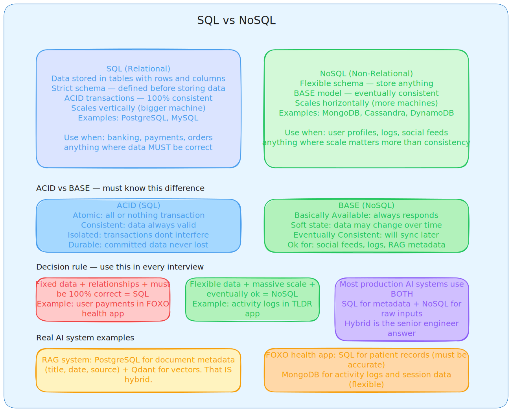
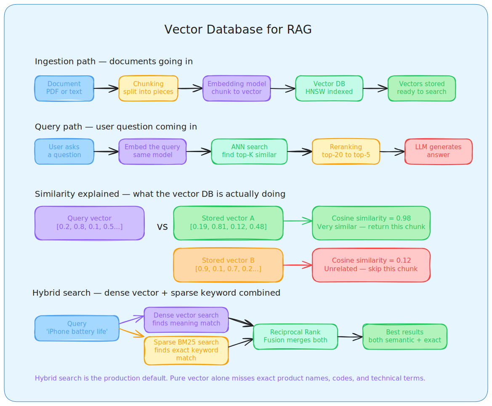
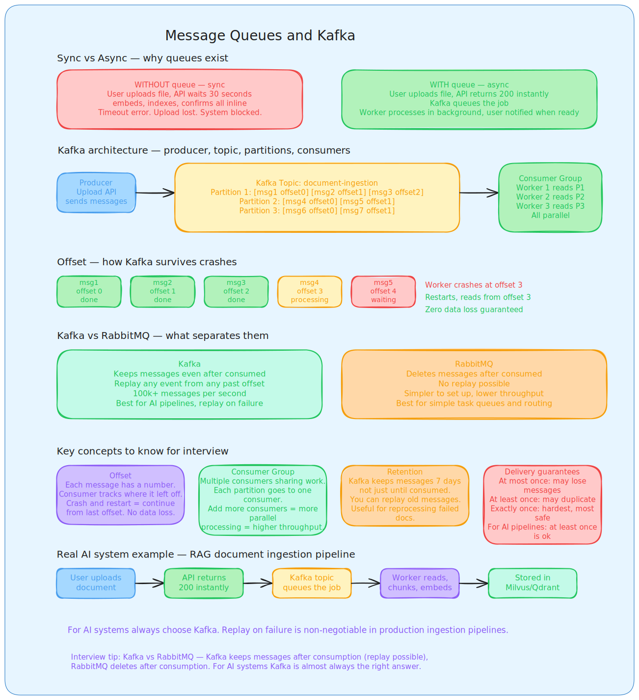
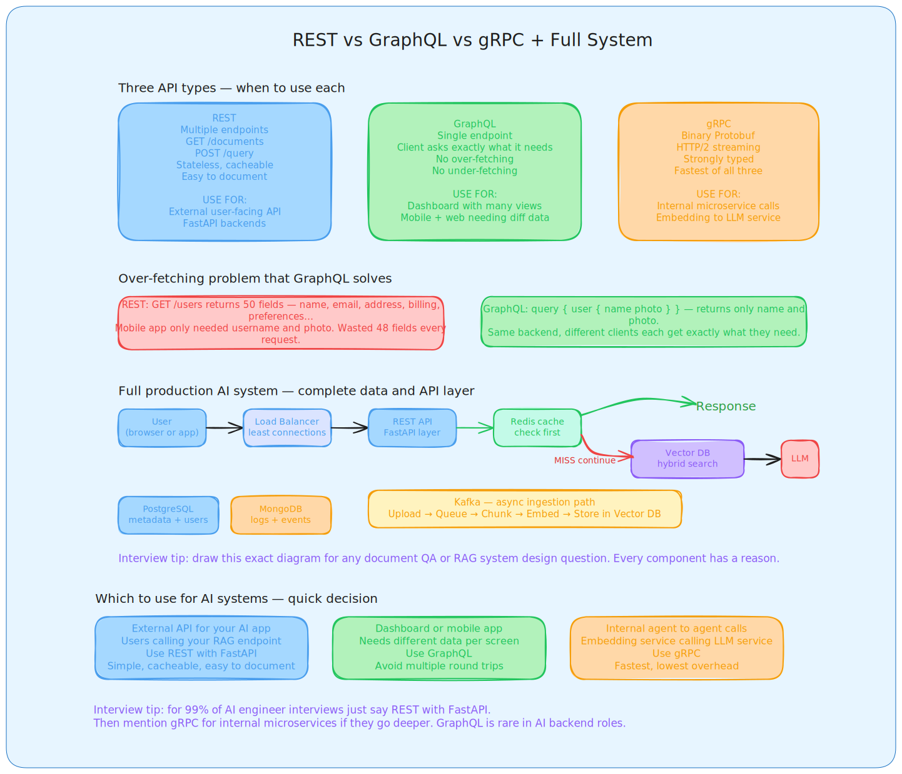
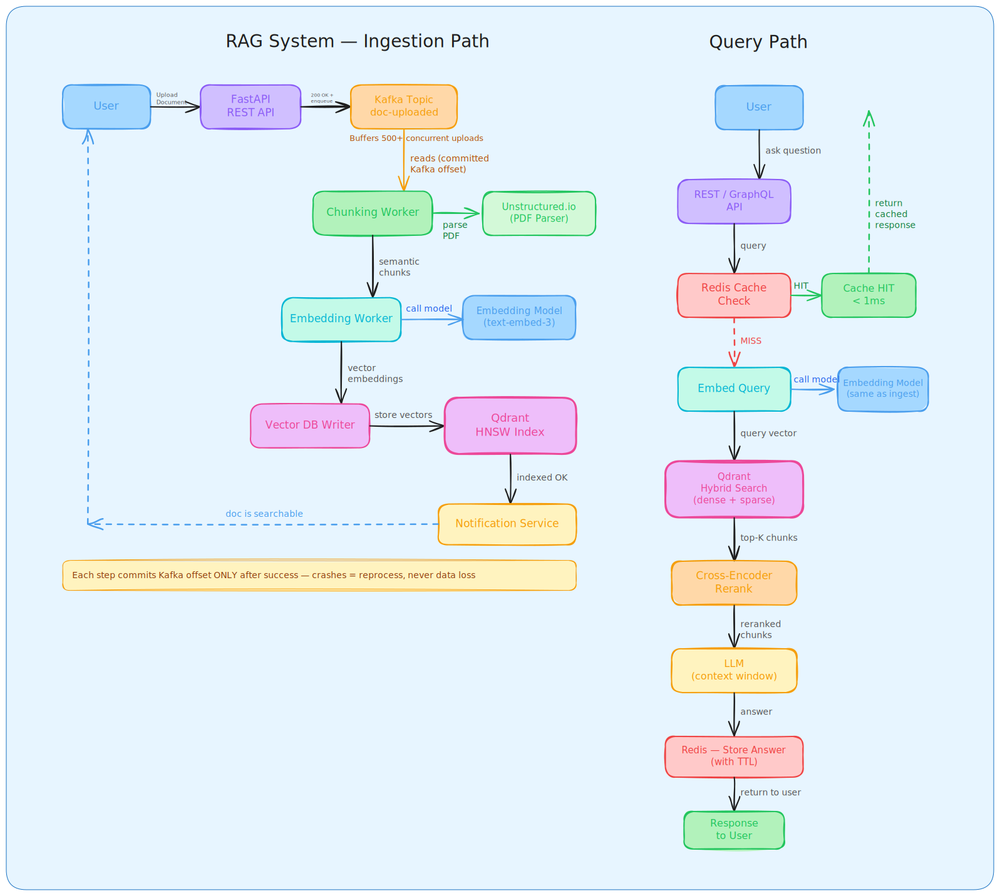

## **Day 2  Databases & APIs**

### 1. SQL vs NoSQL

**What SQL is**

SQL databases store data in structured tables with rows and columns. Every row must follow the same schema that you define before inserting any data. SQL uses ACID transactions which means your data is always in a valid state no matter what happens.

ACID stands for four things. Atomic means the entire transaction succeeds or none of it happens, so if you transfer money from account A to B and it crashes halfway, neither account changes. Consistent means the data is always valid according to your rules. Isolated means two transactions happening at the same time do not interfere with each other. Durable means once a transaction is committed, it survives even a server crash.

SQL databases scale vertically meaning you make the machine bigger. PostgreSQL and MySQL are the most common ones you will see in production.

**What NoSQL is**

NoSQL databases have no fixed structure. You can store documents with different fields in the same collection. Schema changes are easy and painless. They are built to scale horizontally, meaning you add more machines rather than making one machine bigger.

NoSQL follows BASE instead of ACID. Basically Available means the system always responds even if data is slightly out of date. Soft State means data may change over time even without new input. Eventually Consistent means the system will sync across all nodes eventually, just not immediately.

The main NoSQL types are document stores like MongoDB where you store JSON-like objects, key-value stores like Redis and DynamoDB for fast lookups, column-family stores like Cassandra for massive write throughput, and graph databases like Neo4j for relationship-heavy data.

**The decision rule for interviews**

| Situation | Use |
|---|---|
| Payments, billing, user accounts | SQL — ACID is mandatory |
| Activity logs, session data | NoSQL — high write volume, flexible |
| Chat history, document metadata | NoSQL — schema changes often |
| RAG vectors and embeddings | Vector DB — similarity search |
| Mixed production system | Both — hybrid is the senior answer |

The single sentence that positions you as a senior engineer: the right choice depends on access patterns, scalability needs, and consistency requirements. Never say one is always better.

**AI system real examples**

At FOXO health app, patient diagnostic records go in PostgreSQL because if a health record is partially written and crashes, ACID rollback ensures nothing is corrupted. You cannot have eventual consistency when health data is involved. Activity logs and session data go in MongoDB because schema changes as different device types send different shaped data.

In your RAG system, document metadata like title, source, date, and user who uploaded goes in PostgreSQL. Raw ingestion logs go in MongoDB. Actual vectors go in Milvus. Redis sits on top for caching. That is polyglot persistence and it is exactly what production AI systems look like.

**The CAP theorem — know this for follow-up questions**

A distributed system can only guarantee two of three things at once. Consistency means every read gets the most recent write. Availability means every request gets a response. Partition tolerance means the system keeps working even when network splits happen. Since network partitions are unavoidable in real systems, you always choose between consistency and availability. SQL chooses consistency. Most NoSQL databases let you tune where you want to be on that spectrum.

## **2. Vector Databases**

**What problem vector databases solve**

A normal database does exact matching. You write WHERE name = 'cat' and it finds rows containing exactly that word. Nothing related. Nothing similar.

A vector database does similarity matching. You convert your query into a list of numbers representing its meaning, then the database finds other vectors that are mathematically close. This means a query about "feline resting on a rug" can find documents about "cat sitting on a mat" even though no words match. This is what makes RAG possible.

**How embeddings work**

When you send text to an embedding model like OpenAI's text-embedding-3-small, it returns a list of 1536 numbers. That list is called a vector. It represents the meaning of the text in mathematical space. Two sentences with similar meaning produce vectors that are close together in that space. Two completely unrelated sentences produce vectors that are far apart.

Images, audio, and code can all be embedded the same way. The embedding model has learned during training to capture semantic meaning as geometry.

**How vector databases work inside**

The vector database stores these lists of numbers along with metadata like document ID, source, date, and any other fields you attach. When you query with a new vector, it finds the stored vectors that are closest to your query vector. It returns the top K most similar ones. Those chunks then go to the LLM as context.

The similarity is measured using cosine similarity most of the time. Cosine similarity measures the angle between two vectors. A value of 1 means identical meaning. A value of 0 means completely unrelated. Cosine is preferred for text because it ignores the length of the vector and only cares about direction, so a long document and a short document on the same topic score as similar.

**HNSW index — why retrieval is fast**

Without an index, finding the closest vector means comparing your query against every single stored vector. With a million documents that is a million comparisons every query. Too slow.

HNSW stands for Hierarchical Navigable Small World. It builds a multi-layer graph structure over the vectors. Higher layers give coarse navigation, lower layers give precise local search. At query time it navigates this graph rather than scanning everything. The result is finding top-K similar vectors in milliseconds even across hundreds of millions of documents.

IVF is another index type that partitions vectors into clusters and only searches relevant clusters. PQ compresses vectors to reduce memory usage at the cost of some accuracy. Most production deployments use HNSW because it offers the best balance of speed and recall.

**Vector database comparison**

| Database | Type | Best for | What makes it different |
|---|---|---|---|
| Milvus | Open source, self-hosted | Enterprise scale | Distributed, GPU support, hybrid search, you used this at  |
| Qdrant | Open source, self-hosted | Speed and filtering | Rust-based, excellent metadata filtering, hybrid search, you used this in projects |
| Pinecone | Managed cloud | Quick start, no infra | Easiest to set up, expensive at scale, less control |
| pgvector | Postgres extension | Already using Postgres | Adds vector search without a new database |
| Weaviate | Open source or managed | Hybrid search | Built-in GraphQL, good for semantic plus keyword |
| Chroma | Open source | Local prototyping | Python-first, simple API, not for production scale |

For interviews: say Milvus or Qdrant for production self-hosted, Pinecone for managed prototypes. Then say you have hands-on experience with Milvus from  and Qdrant from your Agentic RAG project.

**Hybrid search — the production-ready answer**

Pure vector search has a blind spot. If a user asks about "GPT-4o mini" or a specific product code like "SKU-48291", semantic search might return generally relevant documents but miss the exact term. This is because the embedding model treats these as semantically similar to related concepts rather than exact strings.

Hybrid search combines dense vector search for semantic meaning with sparse keyword search like BM25 for exact term matching. The results from both are merged using Reciprocal Rank Fusion. The final ranking benefits from both. Your Agentic RAG project used dense plus sparse embeddings in Qdrant. That is hybrid search. Say this directly in interviews.

**AI pipeline flow**

| Step | What happens | Where your tools fit |
|---|---|---|
| Ingestion | Document comes in | Unstructured.io for parsing PDFs |
| Chunking | Split into smaller pieces | Semantic chunking strategies you designed |
| Embedding | Each chunk becomes a vector | OpenAI embedding model |
| Indexing | Vectors stored in vector DB | Milvus or Qdrant with HNSW |
| Query | User asks a question | Embed the question |
| Retrieval | Find similar chunks | ANN search, top-K results |
| Reranking | Re-score retrieved chunks | Metadata filtering, MMR, cross-encoder |
| Generation | LLM uses chunks as context | OpenAI or open source LLM |

### 3. Message Queues and Kafka

**What problem message queues solve**

Without a queue, your system is synchronous. User uploads a document, your API waits while it chunks the document, embeds every chunk, stores vectors, and confirms. That takes 20 to 30 seconds. The user sits staring at a spinner. If anything fails, the upload fails. If you get 500 uploads at once, your server collapses.

With a queue, user uploads the document, API returns a 200 OK immediately, the upload job goes into the queue, and a worker picks it up in the background and processes it. User moves on. Worker processes at whatever pace the GPU allows. 500 uploads at once just means 500 messages in the queue. The system processes them in order without any user feeling the load.

This is called temporal decoupling. Producer and consumer do not need to be available at the same time.

**Kafka architecture — the parts you need to know**

A Producer is any service that creates messages and sends them to Kafka. In a RAG system, the upload API is the producer. It creates a message like "process document doc123" and sends it to the Kafka topic.

A Topic is a named channel where messages live. Think of it like a table in a database but append-only. You can have a topic called document-ingestion, another called embedding-complete, another called agent-tasks.

A Partition is how Kafka scales. Each topic is split into multiple partitions. Messages are distributed across partitions. Multiple consumers can read from different partitions in parallel. This is how Kafka handles millions of messages per second. Within one partition messages are strictly ordered. Across partitions ordering is not guaranteed.

A Consumer is any service that reads messages from a topic. Your embedding worker is a consumer. It reads from document-ingestion, embeds the document, stores the vectors, then reads the next message.

An Offset is the position of a message within a partition. Every message has a number. Your consumer tracks which number it last successfully processed. If it crashes and restarts, it reads its last committed offset and continues from exactly where it left off. No messages lost, no starting over.

A Consumer Group is multiple consumers working together on the same topic. Each partition is assigned to exactly one consumer in the group. If you have 10 partitions and add 10 workers, each worker handles one partition in parallel. Adding workers increases throughput linearly up to the number of partitions.

**Kafka vs RabbitMQ**

| Feature | Kafka | RabbitMQ |
|---|---|---|
| Message retention | Keeps messages for configurable days, even after consumption | Deletes messages after consumed |
| Replay | Yes, consumers can re-read old messages | No, once consumed it is gone |
| Throughput | Hundreds of thousands per second | Tens of thousands per second |
| Ordering | Guaranteed within a partition | Guaranteed within a queue |
| Best for | Event streaming, data pipelines, replay, AI ingestion | Simple task queues, RPC, complex routing |
| Complexity | Higher | Lower |

The key difference for interviews: Kafka keeps messages after consumption, RabbitMQ deletes them. For AI systems you almost always want Kafka because if your embedding worker crashes and reprocesses from offset, you want the messages still there.

**Delivery guarantees — know these three**

At most once means messages might be lost but never duplicated. Simplest but unsafe. Never use for important data.

At least once means messages are never lost but might be delivered twice if a consumer crashes after processing but before committing its offset. You handle this by making your consumers idempotent, meaning processing the same message twice has the same result as processing it once.

Exactly once means each message is processed exactly one time. This is the hardest to implement and requires transactional support. For AI ingestion pipelines, at least once with idempotent consumers is the standard practical choice.

**Dead letter queue**

If a message fails processing repeatedly it goes to a dead letter queue instead of blocking the main queue. You can inspect failed messages manually, fix the issue, and replay them. This is how you prevent one bad document from stopping all other documents from being processed.

**Real AI pipeline with Kafka**

User uploads document. API returns 200 immediately and drops a message into Kafka topic document-uploaded. Chunking worker reads the message, splits the document into chunks, sends each chunk to topic chunks-ready. Embedding worker reads from chunks-ready, calls the embedding model, sends vectors to topic vectors-ready. Vector DB writer reads from vectors-ready and stores in Milvus. Notification service reads from vectors-ready and tells the user their document is searchable. If embedding worker crashes at any point, it restarts from its last committed offset and reprocesses without data loss.

### 4. REST vs GraphQL vs gRPC

**REST**

REST uses standard HTTP methods. GET to read, POST to create, PUT to replace, PATCH to update, DELETE to remove. Each resource has its own URL. Responses are JSON. Stateless, simple, cacheable at CDN level.

The problem with REST is over-fetching and under-fetching. Over-fetching means your GET /users endpoint returns 50 fields but your mobile app only needs username and profile photo. All that extra data wastes bandwidth on every request. Under-fetching means you need to make 5 separate API calls to build one screen because each piece of data lives at a different endpoint.

Use REST for external AI APIs, simple CRUD operations, and anything where caching matters. Your FastAPI work at  is REST. This is the right answer for 99% of AI engineer roles.

**GraphQL**

GraphQL has a single endpoint. The client sends a query describing exactly what data it needs and the server returns exactly that. No over-fetching, no under-fetching.

The benefit is that your web dashboard can ask for full analytics data and your mobile app can ask for just a summary. Both use the same endpoint. The backend does not change for each client. This is valuable when you have multiple clients with different data needs.

The downside is that caching is harder because everything is a POST to one endpoint, learning curve is steeper, and you need to implement resolvers for every field.

Use GraphQL when your frontend is complex, has multiple different views with different data requirements, or when building a dashboard that needs dynamic data shapes.

**gRPC**

gRPC uses Protocol Buffers, a binary format, instead of JSON text. Binary is much smaller and faster to parse. It runs on HTTP/2 which enables bidirectional streaming. It is strongly typed, meaning both sides agree on the exact data structure at compile time.

The tradeoff is that it is harder to debug because binary is not human readable, most browsers do not support it natively, and the tooling is less mature than REST.

Use gRPC for internal service to service calls where latency matters. If your embedding service calls your LLM service thousands of times per second internally, the overhead of JSON parsing and HTTP/1.1 adds up. gRPC eliminates that overhead.

**Decision table**

| Situation | Use |
|---|---|
| External user-facing API | REST with FastAPI |
| Mobile app with complex varied data needs | GraphQL |
| Internal microservice calls at high volume | gRPC |
| Embedding service to LLM service internally | gRPC |
| Public documentation and developer API | REST |

**API reliability patterns — mention these to go deeper**

Rate limiting prevents any one client from overwhelming your system. 100 requests per minute per IP is a common starting point.

Circuit breakers detect when a downstream service is failing and stop sending requests to it temporarily instead of piling up failures. If your embedding API is down, the circuit breaker returns an error immediately rather than waiting for a 30 second timeout on every request.

Exponential backoff means when you retry a failed request, you wait 1 second, then 2, then 4, then 8. This gives the failing service time to recover instead of hammering it with retries.

Timeouts prevent requests from hanging forever. Set a 30 second maximum on any LLM call. If it does not respond in 30 seconds, fail fast and return an error the user can understand.

### 5. Complete Data Layer Architecture for a Production RAG System

This is the diagram you draw in every interview when asked to design a document QA system. This is also exactly what you built at .

**Ingestion path**

User uploads document through REST API built with FastAPI. API returns 200 immediately, drops a message into Kafka topic called document-uploaded. Kafka buffers the load so 500 concurrent uploads are handled without the API feeling any pressure. Chunking worker reads from Kafka, uses Unstructured.io to parse the PDF, splits into semantic chunks. Embedding worker reads the chunks, calls the embedding model, produces vectors. Vector DB writer stores vectors in Milvus with HNSW index. Notification service tells the user their document is searchable. Each step commits its Kafka offset only after success, so crashes result in reprocessing not data loss.

**Query path**

User asks a question through REST API or GraphQL depending on the frontend. Query hits Redis first. If the same or similar query was recently answered, return the cached response in under 1ms. On cache miss, embed the query, send to Milvus for hybrid search combining dense and sparse retrieval, get top-K chunks, optionally rerank with a cross-encoder, pass chunks to LLM as context, generate answer, store answer in Redis with TTL, return to user.

**Database responsibilities**

| Database | What it stores | Why this database |
|---|---|---|
| PostgreSQL | User accounts, document metadata, permissions | ACID, relationships, strong consistency |
| MongoDB | Ingestion logs, agent activity, raw events | Flexible schema, high write volume |
| Milvus | Document chunk vectors | HNSW index, hybrid search, enterprise scale |
| Redis | Embedding cache, query cache, agent state | Sub-millisecond reads, TTL, in-memory |

### 6. Day 2 Interview Questions — 20 Questions with Answers

**Q1. When do you choose SQL over NoSQL?**

Choose SQL when data has clear relationships requiring joins, when you need ACID transaction guarantees like payments or health records, when schema is stable and well understood, and when complex multi-table queries are needed. For AI systems, SQL handles user accounts, billing, document ownership, and permissions where data integrity is non-negotiable.

**Q2. When do you choose NoSQL?**

Choose NoSQL when schema is flexible or evolving, when you need horizontal scaling for massive write throughput, when access patterns are simple key lookups rather than complex joins, and when eventual consistency is acceptable. For RAG systems, activity logs, agent action history, and raw ingestion events all suit NoSQL.

**Q3. What is the CAP theorem and how does it affect your database choice?**

A distributed system can only guarantee two of consistency, availability, and partition tolerance simultaneously. Since partitions are unavoidable, you choose between consistency and availability. SQL databases choose consistency. Many NoSQL databases let you tune this. For user payments you choose consistency. For activity feeds you can choose availability.

**Q4. What is a vector database and how does it differ from a normal database?**

A vector database stores high-dimensional numerical representations of data and enables similarity search. A normal database does exact match queries. A vector database answers "what is most similar in meaning to this query." This is what makes semantic search and RAG work. Traditional databases cannot do this efficiently even with extensions.

**Q5. Explain how the RAG retrieval pipeline works from query to answer.**

User asks a question. The question gets embedded into a vector. That vector goes to the vector database which uses HNSW approximate nearest neighbor search to find the top-K stored vectors most similar in meaning. The corresponding document chunks are retrieved. Optionally reranked. Passed to the LLM as context. LLM generates an answer grounded in those chunks.

**Q6. Your vector retrieval is taking 2 seconds. How do you fix it?**

First check if HNSW index is built on the collection. Without it you are doing brute force. Second check embedding cache hit rate in Redis. If the same query comes repeatedly, skip vector search entirely. Third check how many candidates you are pulling before reranking. Pull top 20 not top 200. Fourth check if metadata filtering is happening post-retrieval rather than pre-retrieval. Filter before searching not after.

**Q7. What is hybrid search and when do you use it?**

Hybrid search combines dense vector search for semantic similarity with sparse keyword search like BM25 for exact term matching. Results are merged using Reciprocal Rank Fusion. You use it when queries contain specific product names, codes, or technical terms that semantic search alone might miss. Your Agentic RAG project used dense plus sparse embeddings with Qdrant. That is hybrid search. It is the production-ready default for any real RAG system.

**Q8. Milvus vs Qdrant vs Pinecone — how do you choose?**

Milvus for enterprise self-hosted at scale, full control, GPU support, billions of vectors, good hybrid search. Qdrant for speed and rich metadata filtering, Rust-based performance, excellent for projects needing both filtering and vector search. Pinecone for managed cloud when you want no infrastructure overhead and are comfortable with the cost. You have production experience with Milvus from  and Qdrant from your personal projects. Say this directly.

**Q9. What is a message queue and why does an AI pipeline need one?**

A message queue decouples producers from consumers. Producer drops a message and moves on. Consumer processes when ready. AI pipelines need this because embedding and indexing takes 20 to 30 seconds. If done synchronously the user waits and the API times out. With Kafka the upload returns instantly, the heavy work happens in background, users are notified when ready, and crashes result in reprocessing from offset rather than data loss.

**Q10. Kafka vs RabbitMQ — how do you choose?**

Kafka keeps messages even after consumption for configurable days enabling replay. RabbitMQ deletes messages after consumption. For AI systems choose Kafka because if your embedding worker crashes and restarts, it needs to re-read from where it left off. Kafka enables this. RabbitMQ cannot. Also Kafka handles orders of magnitude more messages per second at scale.

**Q11. What is an offset in Kafka and why does it matter?**

An offset is the position number of a message within a partition. Your consumer tracks the last offset it successfully processed. If it crashes and restarts, it reads its last committed offset and continues from exactly that point. This means no messages are lost and no processing starts over. You commit the offset only after successfully processing the message, not before.

**Q12. 500 documents uploaded simultaneously. How does your ingestion pipeline handle it?**

All 500 upload events go into Kafka instantly. All 500 users get 200 OK. Workers read from Kafka at the pace the embedding GPU allows. Add more consumer instances to the same consumer group and Kafka distributes partitions across them automatically. If you have 10 partitions and 10 workers, throughput scales by 10x immediately with zero changes to the producer or the application logic.

**Q13. What is a dead letter queue and when do you use it?**

A dead letter queue receives messages that fail processing repeatedly. It prevents one bad document from blocking all other documents in the queue. You inspect failed messages manually, diagnose the issue, fix it, and replay the messages from the DLQ. Essential for any production ingestion pipeline.

**Q14. REST vs GraphQL — when do you choose each?**

REST for external user-facing APIs, simple CRUD, anything where HTTP caching matters, and when developer experience and discoverability are important. GraphQL when your frontend has multiple views with different data needs, when you want to avoid over-fetching on mobile, or when aggregating data from multiple backend services into one query. For AI engineer roles the correct default answer is REST with FastAPI. Mention GraphQL only if the architecture genuinely needs it.

**Q15. When would you use gRPC in an AI system?**

For internal microservice calls where latency and throughput matter. If your embedding service calls your LLM service tens of thousands of times per second internally, binary Protocol Buffers over HTTP/2 is significantly faster than JSON over HTTP/1.1. The difference matters at that scale. For external user-facing endpoints stick with REST.

**Q16. Your upload API times out when documents are large. How do you fix it?**

Use a message queue. Upload API saves the raw document, drops a job message into Kafka, returns 200 immediately. Background worker reads from Kafka, processes the document at whatever pace needed, notifies user on completion via webhook or polling endpoint. The API never waits for heavy processing. Timeouts become irrelevant for the user-facing layer.

**Q17. Design the database layer for a document QA system like your  project.**

PostgreSQL for user accounts, document metadata, permissions, subscription status. ACID required because permissions must be accurate and consistent. MongoDB for ingestion logs and agent activity history because schema varies across document types and log volume is high. Milvus for vectors with HNSW index and hybrid dense-sparse search. Redis on top caching embedding vectors and popular query responses with TTL. This is exactly what you built. Own it.

**Q18. Conversational — interviewer says why not just use Postgres for everything including vectors?**

Postgres with pgvector works for small to medium scale, under a few million vectors. But pgvector does not support HNSW as efficiently as dedicated vector databases, lacks advanced filtering combined with vector search, and has significantly higher latency at scale. Also mixing your transactional workload with your vector search workload on the same database creates resource contention. For production RAG at scale, dedicated vector databases like Milvus or Qdrant are the right tool.

**Q19. What is idempotency and why does it matter for Kafka consumers?**

Idempotency means processing the same message twice produces the same result as processing it once. It matters because Kafka at-least-once delivery can deliver the same message twice if a consumer crashes after processing but before committing its offset. If your embedding worker is idempotent, re-embedding the same chunk just overwrites the same vector in the database with the same value. No corruption. For document ingestion, use document ID as the upsert key so repeated processing is safe.

**Q20. Full scenario — design the complete data and async layer for a production RAG system handling 10,000 document uploads per day.**

Start with requirements. 10,000 uploads per day is roughly 7 per minute on average but could spike to hundreds simultaneously. Users expect instant upload confirmation. Search latency target under 2 seconds end to end.

Ingestion path: FastAPI REST endpoint receives upload, stores raw file to object storage, drops message into Kafka topic with document ID. Returns 200 immediately. Consumer group of 5 workers reads from Kafka. Each worker chunks with Unstructured.io, embeds with batch calls to embedding model, stores vectors in Milvus with HNSW index. Commits Kafka offset only after successful storage. Dead letter queue catches failed documents.

Query path: User query hits Redis first for response cache. On miss, embed query, search Milvus with hybrid retrieval, rerank top-20, pass to LLM, cache result in Redis with 1 hour TTL, return to user.

Databases: PostgreSQL for user data and document metadata, MongoDB for logs, Milvus for vectors, Redis for caching. This maps directly to your Agentic RAG project architecture. Say that.
