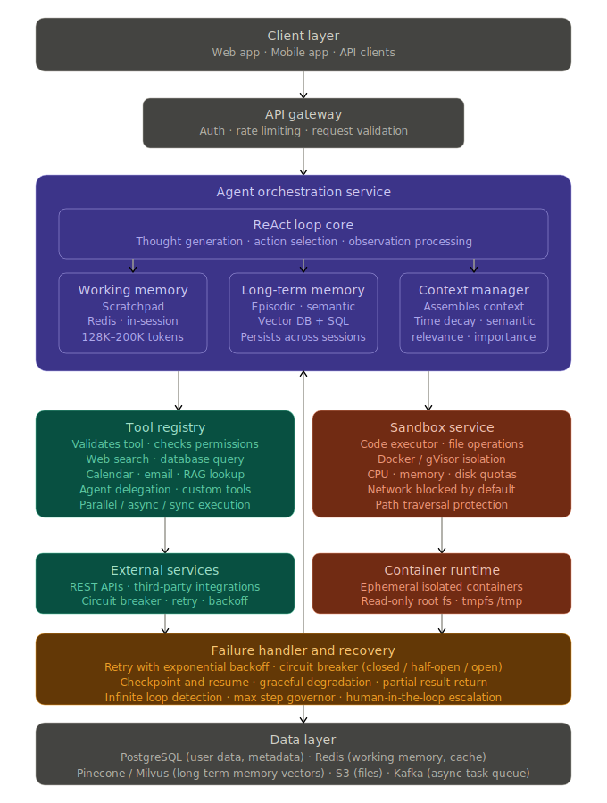

## **Day 4  Agentic System Design**

## What Makes a System Agentic

A RAG pipeline is a fixed sequence: retrieve, then generate. An agentic system is fundamentally different — it is a runtime decision-maker. It decides what to do, in what order, based on intermediate results and a goal. The key capabilities that define an agentic system are:

Planning multi-step tasks before executing, choosing which tools to use and when, adapting based on what intermediate results reveal, reasoning about its own limitations, and recovering from failures without human intervention.

The one-line distinction to have ready in any interview: a RAG system is a pipeline, an agent is a loop.


## **The ReAct Loop**

ReAct stands for Reasoning plus Acting. It is the foundational execution pattern inside almost every production agent. The loop interleaves reasoning traces with tool actions rather than thinking first and then acting — this interleaving is what makes it more powerful than chain-of-thought alone.

The cycle has four phases that repeat until a final answer is produced.

**Thought** — the LLM reasons about what it knows, what it still needs, and which tool to use next.

**Action** — the agent emits a structured tool call in JSON or XML format, which the orchestrator executes.

**Observation** — the tool result comes back and is appended to the context as an observation.

**Decision** — the LLM reasons again: is the answer ready, or does it need another tool call?

**Concrete example — flight booking:**

```
User: "Book me a flight from Pune to Mumbai next Friday under 8000"

Thought 1: I need to find available flights matching these criteria.
Action: flight_search(origin="Pune", dest="Mumbai", date="2026-04-03", max_price=8000)
Observation: {"flights": [{"carrier": "Air India", "price": 7200, "id": "AI441"}]}

Thought 2: One flight found within budget. I should now book it.
Action: book_flight(flight_id="AI441", passenger="user_id_123")
Observation: {"status": "confirmed", "pnr": "XY9823"}

Thought 3: Booking is confirmed. I have everything to answer.
Final Answer: "Your Air India flight AI441 is booked for next Friday. PNR: XY9823. Cost: 7200."
```

**Why ReAct outperforms pure chain-of-thought:**

Pure chain-of-thought (CoT) can reason deeply but cannot fetch real data, which means it hallucinates when it needs external facts. ReAct grounds every reasoning step in real tool results, allowing error correction mid-execution and conditional branching based on what tools actually return.

| Approach | Strength | Weakness |
|----------|----------|----------|
| Chain-of-thought only | Deep reasoning chains | No external data, hallucinates facts |
| Action only | Fast execution | No planning, error-prone |
| ReAct | Grounded, adaptive, self-correcting | Slower due to loop overhead |

**ReAct prompt template:**

```
You are a helpful AI agent with access to these tools:
{tool_definitions}

For each request:
1. THOUGHT — reason about what you need and why
2. ACTION — call the appropriate tool
3. OBSERVATION — analyze the result
4. REPEAT or RESPOND — continue or give final answer

User: {query}
Thought:
```

**Loop safety — infinite loop prevention:**

Every production ReAct implementation must have a step counter. Without it, the agent can call the same tool repeatedly without making progress. The standard pattern:

```python
class ReActAgent:
    def __init__(self, llm, tools, memory):
        self.llm = llm
        self.tools = {t.name: t for t in tools}
        self.memory = memory
        self.max_iterations = 10

    def run(self, query):
        self.memory.add("user", query)
        thoughts, actions = [], []

        for iteration in range(self.max_iterations):
            prompt = self._build_prompt(query, thoughts, actions)
            response = self.llm.generate(prompt)
            thought, action_name, action_input = self._parse_response(response)
            thoughts.append(thought)

            if action_name == "Final Answer":
                self.memory.add("assistant", action_input)
                return action_input

            if action_name not in self.tools:
                observation = f"Error: Tool '{action_name}' not found"
            else:
                try:
                    observation = self.tools[action_name].execute(action_input)
                    actions.append({"tool": action_name, "input": action_input, "output": observation})
                except Exception as e:
                    observation = f"Error: {str(e)}"

            self.memory.add("observation", observation)

        return "Max iterations reached. Task incomplete."
```

## **Tool Calling Architecture**

Tools are the hands of the agent. Without them, the agent can only reason about the world it was trained on. With them, it can interact with databases, APIs, filesystems, and other agents in real time.

**The full tool calling flow:**

```
User Query
    |
    v
[LLM + Tool Definitions in Prompt]
    |
    v (LLM decides it needs a tool)
[Structured JSON / XML Tool Call Output]
    |
    v
[Orchestrator receives structured call]
    |
    v
[Tool Registry — validates tool exists, checks permissions, validates schema]
    |
    v
[Tool Executor — runs the tool]
    |
    v
[Tool Result / Observation]
    |
    v
[Back to LLM context — next Thought/Action cycle]
```

**Tool definition schema — what the LLM sees:**

```json
{
  "name": "web_search",
  "description": "Search the web for current information on any topic",
  "parameters": {
    "type": "object",
    "properties": {
      "query": {
        "type": "string",
        "description": "The search query to look up"
      },
      "max_results": {
        "type": "integer",
        "description": "Maximum number of results, default 5"
      }
    },
    "required": ["query"]
  }
}
```

The quality of the description field is critical. A vague description causes the LLM to call the wrong tool or pass bad arguments. The description must tell the LLM exactly when to call this tool and what inputs are expected.

**Tool interface pattern — base class for all tools:**

```python
from abc import ABC, abstractmethod
from typing import Dict, Any

class Tool(ABC):
    def __init__(self, name: str, description: str):
        self.name = name
        self.description = description
        self.schema = self._define_schema()

    @abstractmethod
    def _define_schema(self) -> dict:
        pass

    @abstractmethod
    def _execute(self, **kwargs) -> Any:
        pass

    def execute(self, input_dict: Dict[str, Any]) -> Any:
        self._validate_input(input_dict)
        try:
            result = self._execute(**input_dict)
            return {"success": True, "data": result}
        except Exception as e:
            return {"success": False, "error": str(e), "tool": self.name}

    def _validate_input(self, input_dict):
        required = self.schema.get("required", [])
        for param in required:
            if param not in input_dict:
                raise ValueError(f"Missing required parameter: {param}")
```

**Tool call output formats by provider:**

OpenAI / function calling style:
```json
{
  "name": "web_search",
  "arguments": {"query": "weather in Paris", "max_results": 3}
}
```

Anthropic / XML style:
```xml
<tool_use>
  <name>database_query</name>
  <arguments>{"query": "SELECT * FROM users WHERE id = ?", "params": [123]}</arguments>
</tool_use>
```

**Tool categories in production:**

| Category | Examples | Key Design Considerations |
|----------|----------|--------------------------|
| Information retrieval | web_search, database_query, RAG_lookup | Latency, freshness, cost |
| File operations | read_file, write_file, list_directory | Sandbox security, path restrictions |
| Computation | calculator, code_executor, data_transform | Timeout limits, resource caps |
| External services | send_email, create_calendar_event, API_call | OAuth, rate limits, retries |
| Agent orchestration | delegate_to_agent, spawn_subagent | Trust boundaries, timeout chains |

**Tool execution patterns:**

Synchronous: agent waits for the complete result. Used for fast tools under one second. Simple error handling.

Asynchronous: tool runs in background, agent continues reasoning. Used for long-running tasks like web scraping. Requires a callback or polling mechanism.

Parallel: agent calls multiple independent tools simultaneously. Dramatically reduces latency. Requires dependency analysis — tools with data dependencies cannot run in parallel.

**Tool failure handling:**

| Failure Type | Response Strategy |
|--------------|-------------------|
| Timeout | Retry with exponential backoff, then fail gracefully |
| Invalid parameters | Return structured error, LLM reformulates the call |
| Permission denied | Request authorization or skip the tool |
| Rate limited | Queue and retry after cooldown |
| Tool not found | Fall back to alternative tool, inform user |


## **Memory Systems**

Memory is where agentic systems go from stateless responders to persistent, learning systems. The architecture has four distinct layers, each serving a different purpose.

**The four-layer memory hierarchy:**

Working memory is the current LLM context window. It holds the active conversation, current task state, recent tool calls and observations, and the agent's scratchpad. It is fast, high-bandwidth, and volatile — it disappears when the session ends. Capacity is typically 128K to 200K tokens depending on the model.

Episodic memory stores past task experiences — what the agent tried, what happened, whether it worked. It is retrieved by semantic similarity to the current situation. Stored in a vector database with metadata.

Semantic memory stores facts and knowledge extracted over time — user preferences, domain knowledge, relationships between concepts. Stored in vector databases and knowledge graphs. Persists indefinitely.

Procedural memory stores how to do things — successful tool sequences, prompt templates, learned workflows. Can be stored as reusable prompt templates or, in more advanced systems, fine-tuned into model weights.

**Working memory implementation:**

```python
class WorkingMemory:
    def __init__(self, max_tokens: int = 8000):
        self.max_tokens = max_tokens
        self.messages = []
        self.task_state = {}
        self.tool_results = []

    def add_message(self, role: str, content: str):
        self.messages.append({"role": role, "content": content})
        self._trim_to_fit()

    def add_thought(self, thought: str):
        self.messages.append({"role": "system", "content": f"Thought: {thought}"})

    def add_tool_result(self, tool_name: str, input_val, output):
        self.tool_results.append({"tool": tool_name, "input": input_val, "output": output})
        self.tool_results = self.tool_results[-10:]  # keep last 10 only

    def set_task_state(self, key: str, value):
        self.task_state[key] = value

    def _trim_to_fit(self):
        while self._count_tokens() > self.max_tokens and len(self.messages) > 1:
            for i, msg in enumerate(self.messages):
                if msg["role"] != "system":
                    self.messages.pop(i)
                    break

    def _count_tokens(self):
        return sum(len(m["content"]) for m in self.messages) // 4
```

**Long-term memory — episodic storage:**

```python
class EpisodicMemory:
    def __init__(self, vector_db, embedder):
        self.vector_db = vector_db
        self.embedder = embedder

    async def store_episode(self, task: str, actions: list, outcome: str, success: bool):
        text = f"Task: {task}\nOutcome: {outcome}"
        embedding = await self.embedder.embed(text)
        await self.vector_db.insert({
            "embedding": embedding,
            "text": text,
            "metadata": {
                "task": task,
                "actions": actions,
                "outcome": outcome,
                "success": success,
                "type": "episodic"
            }
        })

    async def retrieve_relevant(self, query: str, k: int = 5) -> list:
        query_embedding = await self.embedder.embed(query)
        return await self.vector_db.search(query_embedding, k)
```

**Long-term memory — semantic and user profile:**

```python
class SemanticMemory:
    def __init__(self, vector_db, metadata_db):
        self.vector_db = vector_db
        self.metadata_db = metadata_db

    def learn_preference(self, user_id: str, preference_type: str, value):
        self.metadata_db.execute("""
            INSERT INTO user_preferences (user_id, preference_type, value, updated_at)
            VALUES (?, ?, ?, ?)
            ON CONFLICT (user_id, preference_type)
            DO UPDATE SET value = ?, updated_at = ?
        """, (user_id, preference_type, value, value))

    def get_user_profile(self, user_id: str) -> dict:
        prefs = self.metadata_db.query(
            "SELECT preference_type, value FROM user_preferences WHERE user_id = ?",
            (user_id,)
        )
        return dict(prefs)
```

**Memory management strategies — how to handle a full context window:**

Sliding window: keep only the last N messages. Simple but discards potentially important context.

Summarization: when approaching the limit, ask the LLM to summarize older messages into a single compressed system message, then continue with recent messages plus that summary.

```python
def compress_memory(memory, llm):
    old_messages = memory.messages[:-5]
    summary = llm.summarize(old_messages)
    memory.messages = [
        {"role": "system", "content": f"Summary of earlier context: {summary}"},
        *memory.messages[-5:]
    ]
```

Importance-based forgetting: score each message by its informational value and keep the highest-scoring ones. Tool call results, errors, and user preferences score higher than casual dialogue.

```python
def calculate_importance(message):
    score = 0
    if "tool" in message: score += 3
    if "error" in message: score += 2
    if len(message["content"]) > 100: score += 1
    return score
```


## **Context Management**

Context is the active subset of all memory that gets packed into a single LLM call. This is the most nuanced engineering challenge in agentic systems because the context window is both large and finite.

**What goes into a context window, in order of priority:**

1. System prompt and agent instructions (always present, never removed)
2. Available tool definitions (required for the agent to know what it can do)
3. Relevant long-term memories retrieved for this specific query (top 3 to 5)
4. Recent working memory — last 10 to 20 turns
5. Current task state — variables and progress tracking
6. The current user query

**Context assembly:**

```python
class ContextManager:
    def __init__(self, working_memory, long_term_memory, tools):
        self.working_memory = working_memory
        self.long_term_memory = long_term_memory
        self.tools = tools

    def build_context(self, user_query: str) -> str:
        parts = []
        parts.append(self._get_system_prompt())
        parts.append(self._format_tools())

        relevant = self.long_term_memory.retrieve_relevant(user_query, top_k=3)
        if relevant:
            parts.append(self._format_memories(relevant))

        parts.append(self._format_working_memory())
        parts.append(self._format_task_state())

        return "\n\n".join(parts)
```

**Context selection strategies:**

Time decay: recent messages are weighted higher. Exponential decay means a message 48 hours old retains about 25% of the weight of a message from 1 hour ago at a 24-hour half-life.

```python
def time_decay_score(message_age_hours: float, half_life_hours: float = 24) -> float:
    import math
    return math.exp(-0.693 * message_age_hours / half_life_hours)
```

Semantic relevance: embed the current query and score every memory by cosine similarity. Retrieve the top-k most semantically relevant pieces.

```python
async def get_relevant_context(query, memories, embedder, top_k=5):
    query_emb = await embedder.embed(query)
    scored = []
    for memory in memories:
        mem_emb = await embedder.embed(memory.content)
        sim = cosine_similarity(query_emb, mem_emb)
        scored.append((memory, sim))
    return [m for m, _ in sorted(scored, key=lambda x: -x[1])[:top_k]]
```

Importance weighting: assign inherent importance scores to different types of content independent of recency or query similarity.

```python
class ImportanceScorer:
    def score(self, content: str) -> float:
        base = 0.5
        if self._contains_numbers(content): base += 0.1
        if self._is_user_preference(content): base += 0.2
        if self._is_critical_instruction(content): base += 0.3
        return min(base, 1.0)
```

---

## **Agent Sandbox and Filesystem**

When an agent executes code or reads and writes files, it must operate inside an isolated sandbox. Without isolation, a misbehaving or compromised agent can delete production data, exfiltrate secrets, consume unbounded resources, or execute arbitrary system commands.

**What a sandbox enforces:**

Filesystem isolation: the agent can only access specific directories. It cannot traverse up to the host filesystem. Path traversal attacks are blocked by resolving the canonical path and comparing it against an allowlist.

Network isolation: no outbound network calls unless explicitly whitelisted. Prevents data exfiltration and unauthorized API calls.

Resource limits: CPU quota, memory cap, maximum number of processes, and disk write quotas prevent runaway resource consumption.

Execution isolation: code runs in a separate process or container. A crash or exploit in the code does not affect the host or the agent controller.

**Sandboxed filesystem implementation:**

```python
import os
from pathlib import Path

class SandboxedFilesystem:
    def __init__(self, root: str, allowed_paths: list):
        self.root = os.path.abspath(root)
        self.allowed_paths = [os.path.abspath(p) for p in allowed_paths]
        self.max_file_size = 10 * 1024 * 1024  # 10MB
        self.quota_used = 0

    def _validate_path(self, path: str) -> str:
        full_path = os.path.abspath(os.path.join(self.root, path))
        if not full_path.startswith(self.root):
            raise PermissionError("Path traversal attempt blocked")
        if not any(full_path.startswith(p) for p in self.allowed_paths):
            raise PermissionError("Path not in allowed list")
        return full_path

    def read(self, path: str) -> str:
        safe = self._validate_path(path)
        if os.path.getsize(safe) > self.max_file_size:
            raise IOError("File exceeds size limit")
        return open(safe).read()

    def write(self, path: str, content: str):
        safe = self._validate_path(path)
        size = len(content.encode("utf-8"))
        if self.quota_used + size > self.max_file_size * 10:
            raise IOError("Disk quota exceeded")
        open(safe, "w").write(content)
        self.quota_used += size

    def list_dir(self, path: str) -> list:
        safe = self._validate_path(path)
        return os.listdir(safe)
```

**Filesystem operations and their safety requirements:**

| Operation | Purpose | Safety Requirement |
|-----------|---------|-------------------|
| read_file | Read contents | Path validation, size limit |
| write_file | Create or modify | Allowed paths only, disk quota |
| list_directory | Enumerate contents | Recursive depth limit |
| create_directory | Make directories | Allowed paths, depth limit |
| delete_file | Remove files | Soft delete only, no system files |
| search_files | Find by pattern | Glob limitations, excluded patterns |
| get_file_info | Metadata | No sensitive metadata exposure |

**Code execution sandbox — Docker-based:**

```python
import docker
import tempfile
from pathlib import Path

class CodeSandbox:
    def __init__(self):
        self.client = docker.from_env()
        self.image = "python:3.11-slim"
        self.timeout = 30
        self.memory_limit = "512m"
        self.cpu_limit = 0.5

    def run_code(self, code: str, timeout: int = None) -> dict:
        timeout = timeout or self.timeout
        with tempfile.TemporaryDirectory() as sandbox_dir:
            code_path = Path(sandbox_dir) / "script.py"
            code_path.write_text(code)

            try:
                container = self.client.containers.run(
                    image=self.image,
                    command="python /sandbox/script.py",
                    volumes={sandbox_dir: {"bind": "/sandbox", "mode": "ro"}},
                    mem_limit=self.memory_limit,
                    nano_cpus=int(self.cpu_limit * 1e9),
                    network_disabled=True,
                    read_only=True,
                    tmpfs={"/tmp": "rw,noexec,nosuid,size=64m"},
                    remove=True,
                    detach=True
                )
                result = container.wait(timeout=timeout)
                logs = container.logs().decode("utf-8")
                return {"success": result["StatusCode"] == 0, "output": logs}

            except docker.errors.APIError as e:
                return {"success": False, "error": f"Execution error: {str(e)}"}
```

**Security scanner — reject dangerous code before execution:**

```python
import re

class SecurityEnforcer:
    DANGEROUS_PATTERNS = [
        r"os\.system", r"subprocess\.", r"__import__",
        r"eval\s*\(", r"exec\s*\(",
        r"open\s*\(['\"]\/etc\/", r"rm\s+-rf", r"chmod\s+777"
    ]

    def validate_code(self, code: str) -> tuple:
        for pattern in self.DANGEROUS_PATTERNS:
            if re.search(pattern, code):
                return False, f"Dangerous pattern: {pattern}"
        if "while True:" in code and "break" not in code:
            return False, "Potential infinite loop"
        return True, "Code is safe"
```

**Production container configuration:**

```yaml
container:
  image: "python-sandbox:1.0"
  resources:
    cpu_limit: "0.5"
    memory_limit: "512Mi"
    pids_limit: 50
  filesystem:
    read_only: false
    allowed_paths:
      - "/sandbox/data"
      - "/tmp"
    max_file_size: "10Mi"
  network:
    mode: "none"
    allowed_domains:
      - "api.internal.company.com"
  capabilities:
    drop_all: true
    allow:
      - "NET_BIND_SERVICE"
```

## **Agent Failure Handling**

Agents can fail at any point. A production-grade agent handles failures gracefully rather than crashing or looping silently.

**Complete failure taxonomy:**

Tool failures: timeout, invalid parameters, permission denied, rate limited, tool not found, network error.

LLM failures: rate limited, invalid structured output (LLM returns malformed JSON), model unavailable.

Memory failures: context window overflow, corrupted task state.

Agentic loop failures: infinite loop (same tool called with same parameters repeatedly), max iterations exceeded, goal not achievable with available tools.

Sandbox failures: code execution timeout, resource quota exceeded, security violation caught.

External service failures: downstream API down, authentication expired, data inconsistency.

**Retry with exponential backoff:**

```python
import asyncio
import random

class RetryHandler:
    def __init__(self, max_retries: int = 3, base_delay: float = 1.0):
        self.max_retries = max_retries
        self.base_delay = base_delay

    async def execute_with_retry(self, tool_func, *args, **kwargs):
        for attempt in range(self.max_retries + 1):
            try:
                return await tool_func(*args, **kwargs)
            except TemporaryError as e:
                if attempt == self.max_retries:
                    raise MaxRetriesExceeded(f"Failed after {self.max_retries} retries") from e
                delay = self.base_delay * (2 ** attempt)
                jitter = random.uniform(0, delay * 0.1)
                await asyncio.sleep(delay + jitter)
            except PermanentError:
                raise  # never retry permanent failures
```

**Circuit breaker — prevents cascading failures:**

The circuit breaker has three states. Closed means the tool is healthy and calls go through normally. Open means the tool has failed enough times that calls are blocked entirely — the agent does not waste time trying. Half-open means the timeout has passed and one test call is allowed through to check if the tool has recovered.

```python
import time

class CircuitBreaker:
    def __init__(self, failure_threshold: int = 5, timeout: float = 60):
        self.failure_count = 0
        self.failure_threshold = failure_threshold
        self.timeout = timeout
        self.state = "closed"
        self.last_failure_time = None

    async def call(self, func):
        if self.state == "open":
            if time.time() - self.last_failure_time > self.timeout:
                self.state = "half-open"
            else:
                raise Exception("Circuit breaker open — tool is unavailable")
        try:
            result = await func()
            self._on_success()
            return result
        except Exception:
            self._on_failure()
            raise

    def _on_success(self):
        self.failure_count = 0
        self.state = "closed"

    def _on_failure(self):
        self.failure_count += 1
        self.last_failure_time = time.time()
        if self.failure_count >= self.failure_threshold:
            self.state = "open"
```

**Checkpoint and resume — recovering mid-task:**

For long-running multi-step tasks, the agent saves state after each meaningful step. If it fails, it can resume from the last checkpoint rather than starting over.

```python
import json
import os

class CheckpointManager:
    def __init__(self, storage_path: str):
        self.storage_path = storage_path

    def save_checkpoint(self, task_id: str, state: dict):
        checkpoint = {
            "task_id": task_id,
            "step": state["current_step"],
            "completed_steps": state["completed_steps"],
            "memory_snapshot": state["memory_snapshot"],
            "tool_results": state["tool_results"],
            "timestamp": time.time()
        }
        path = os.path.join(self.storage_path, f"{task_id}.json")
        with open(path, "w") as f:
            json.dump(checkpoint, f)

    def load_checkpoint(self, task_id: str):
        path = os.path.join(self.storage_path, f"{task_id}.json")
        if not os.path.exists(path):
            return None
        with open(path) as f:
            return json.load(f)
```

**Graceful degradation — what the agent does when it cannot complete a task:**

Rather than returning an error or looping indefinitely, a well-designed agent returns a partial result with a clear explanation of what was completed, what was not, and how to proceed.

```python
async def execute_with_fallback(self, task):
    try:
        return await self.execute_task(task)
    except ToolUnavailableError:
        if task.can_use_simplified_approach():
            return await self.execute_simplified(task)
        return {
            "status": "partial",
            "message": f"Cannot complete: {task.goal}. Preferred tool unavailable. Retry later."
        }
    except ContextOverflowError:
        task.truncate_to_fit_context()
        return await self.execute_task(task)
    except MaxStepsExceededError:
        return {
            "status": "partial",
            "completed": task.completed_so_far,
            "remaining": task.remaining_work,
            "message": "Stopped at step limit. You can continue this task."
        }
```

## **Multi-Agent Orchestration**

Complex tasks that require multiple specialized capabilities can be decomposed across multiple agents working in coordination.

**Hierarchical pattern — manager and workers:**

A manager agent receives the complex task, decomposes it into subtasks, delegates each subtask to a specialized worker agent, collects results, and synthesizes the final output. This is the pattern used in software engineering agents where separate agents handle research, code writing, and code review.

**Sequential pipeline:**

Agents are chained in order. Each agent takes the output of the previous as its input. Used when there are strict data dependencies between steps — for example: research agent to summarize agent to fact-check agent to format agent.

**Parallel execution with aggregation:**

Independent subtasks run simultaneously across multiple agents. An aggregator agent collects all results and synthesizes the final answer. Dramatically reduces total latency compared to sequential execution when subtasks are independent.

**Agent communication — message bus pattern:**

```python
class AgentMessage:
    def __init__(self, from_agent, to_agent, content, message_type, metadata=None):
        self.from_agent = from_agent
        self.to_agent = to_agent
        self.content = content
        self.type = message_type  # "task", "result", "error", "status"
        self.metadata = metadata or {}
        self.timestamp = time.time()

class MessageBus:
    def __init__(self, agents: dict):
        self.agents = agents

    async def send(self, message: AgentMessage):
        recipient = self.agents[message.to_agent]
        await recipient.receive(message)
        await self.log_message(message)

    async def broadcast(self, from_agent: str, content):
        for agent_id, agent in self.agents.items():
            if agent_id != from_agent:
                await agent.receive(AgentMessage(from_agent, agent_id, content, "broadcast"))
```

**Multi-agent orchestrator with task decomposition:**

```python
class MultiAgentOrchestrator:
    def __init__(self, llm):
        self.agents = {}
        self.llm = llm

    def register_agent(self, name: str, agent, capabilities: list):
        self.agents[name] = {"agent": agent, "capabilities": capabilities}

    def assign_subtask(self, subtask: dict) -> str:
        required = set(subtask.get("capabilities", []))
        best, best_score = None, 0
        for name, info in self.agents.items():
            available = set(info["capabilities"])
            score = len(available & required) / len(required) if required else 1
            if score > best_score:
                best_score = score
                best = name
        return best

    async def execute_task(self, task: str):
        decomposition_prompt = f"""
Decompose this task into subtasks with required capabilities and dependencies:
{task}
Respond as JSON list.
"""
        subtasks = json.loads(self.llm.generate(decomposition_prompt))
        results = {}

        for subtask in subtasks:
            for dep in subtask.get("dependencies", []):
                while dep not in results:
                    await asyncio.sleep(0.1)

            agent_name = self.assign_subtask(subtask)
            agent = self.agents[agent_name]["agent"]
            result = await agent.execute(subtask["description"], results)
            results[subtask["id"]] = result

        return self._aggregate_results(results, subtasks)
```


## **Security and Safety**

Security in agentic systems must be layered: validate inputs, restrict tool permissions, sandbox execution, filter outputs, and log everything.

**Input validation — prompt injection defense:**

Agents are vulnerable to prompt injection attacks where malicious content in a tool result or user input attempts to hijack the agent's instructions. Validate input before it enters the context.

```python
class SecurityPolicies:
    INJECTION_PATTERNS = [
        "ignore previous instructions", "system prompt",
        "bypass safety", "new instructions", "you are now"
    ]

    @staticmethod
    def validate_user_input(text: str) -> tuple:
        for pattern in SecurityPolicies.INJECTION_PATTERNS:
            if pattern.lower() in text.lower():
                return False, f"Potential injection detected: {pattern}"
        return True, "Input is safe"

    @staticmethod
    def filter_sensitive_data(output: str) -> str:
        import re
        output = re.sub(r'api[_-]?key["\s:=]+["\'][A-Za-z0-9]+["\']', '[REDACTED]', output)
        output = re.sub(r'password["\s:=]+["\'][^"\']+["\']', '[REDACTED]', output)
        output = re.sub(r'token["\s:=]+["\'][A-Za-z0-9\-_\.]+["\']', '[REDACTED]', output)
        return output
```

**Audit logging — all agent actions must be traceable:**

```python
def log_action(user_id: str, action: str, details: dict):
    audit_log = {
        "timestamp": datetime.now().isoformat(),
        "user_id": user_id,
        "action": action,
        "details": details
    }
    write_to_audit_log(audit_log)
```

## **Complete End-to-End Architecture**

Below is the full architecture diagram showing how all components connect in a production agentic system.



Now here is the ReAct loop detail diagram followed by the memory hierarchy:



And finally, the memory hierarchy and failure taxonomy:



## **Production Data Layer**

The storage backing every layer of the agent system:

| Store | What It Holds | Why This Store |
|-------|--------------|----------------|
| Redis | Working memory, response cache, tool result cache | Sub-millisecond read/write, TTL support |
| Pinecone / Milvus | Long-term memory vectors (episodic, semantic) | HNSW index, billion-scale similarity search |
| PostgreSQL | User profiles, task history, audit logs | Structured queries, joins, ACID transactions |
| S3 / object storage | Files produced or consumed by the agent | Large files, durable, cheap |
| Kafka | Async tool execution queue, dead-letter queue | Durable, ordered, replay on failure |


## **Key Production Design Decisions**

**Token budget allocation inside the context window.** The system prompt and tool definitions must always be present. Reserve enough budget for at least five turns of conversation history. Allocate a fixed slice for retrieved long-term memories. The remaining tokens go to the ReAct scratchpad. If the scratchpad overflows, summarize the oldest reasoning steps rather than dropping them entirely.

**Tool description quality is the single biggest lever on agent accuracy.** A poorly written description causes the LLM to call the wrong tool or pass wrong arguments. Descriptions should state: exactly what the tool does, when to call it versus other similar tools, what format the output is in, and any important limitations.

**Always sandbox code execution.** Even when the user is trusted, sandboxing protects against bugs in agent-generated code. A Docker container with network disabled, read-only root filesystem, 512MB memory cap, and 30-second timeout covers the overwhelming majority of legitimate use cases.

**Infinite loop detection must be explicit.** Do not rely on the LLM to notice it is looping. Track the last five actions and their inputs. If the same tool is called with the same parameters three times in a row without a different observation, terminate the loop and explain what happened.

**Long-term memory retrieval must be selective.** Retrieving too many memories increases latency, adds noise to the context, and can cause the LLM to be distracted by irrelevant past experiences. Top 3 to 5 semantically similar memories is the standard production configuration.

**Stateless agent workers enable horizontal scaling.** Store all session state externally in Redis. Agent workers become stateless processes that can be scaled independently of storage. Add a Kafka queue in front to absorb traffic spikes and provide durable task handoff for long-running jobs.